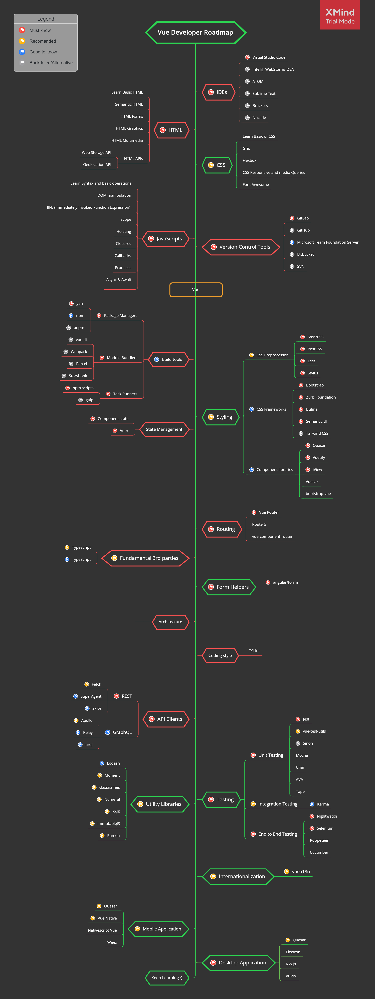

# Vue Developer Roadmap

> Roadmap to becoming a Vue developer in 2021:

Below you can find a chart demonstrating the paths that you can take and the libraries that you would want to learn to become a Vue developer. I made this chart as a tip for everyone who asks me, "What should I learn next as a Vue developer?"

## Disclaimer

> The purpose of this roadmap is to give you an idea about the landscape. The road map will guide you if you are confused about what to learn next, rather than encouraging you to pick what is hip and trendy. You should grow some understanding of why one tool would be better suited for some cases than the other and remember hip and trendy does not always mean best suited for the job

## Give a Star! :star:

If you like or are using this project to learn or start your solution, please give it a star. Thanks!

## Roadmap

## Resources

1. IDEs

    - [visualstudio](https://visualstudio.microsoft.com/downloads/)
    - [visualstudioCode](https://code.visualstudio.com/Download)

2. HTML

    - [w3schools](https://www.w3schools.com/html/) HTML Tutorial
    - [MDN Web Docs](https://developer.mozilla.org/en-US/docs/Web/HTML) HTML: HyperText Markup Language

3. CSS

    - [w3schools](https://www.w3schools.com/css/) CSS Tutorial
    - [MDN Web Docs](https://developer.mozilla.org/en-US/docs/Web/CSS) CSS: Cascading Style Sheets
    - [fontawesome](https://fontawesome.com/) Official website
    - [w3schools](https://www.w3schools.com/icons/icons_reference.asp) Icons Reference

4. JavaScript

    _Basic_

    - [w3schools](https://www.w3schools.com/js/default.asp) JavaScript Tutorial
    - [developer.mozilla](https://developer.mozilla.org/en-US/docs/Web/JavaScript) JavaScript
    - [javascript.info](https://javascript.info/) The Modern JavaScript Tutorial
    - [htmlcheatsheet](https://htmlcheatsheet.com/js/) JS CheatSheet

    _es6_

    - [exploringjs](https://exploringjs.com/es6/index.html) Exploring ES6
    - [es6-features](http://es6-features.org/#Constants) ECMAScript 6 — New Features: Overview & Comparison
    - [jsfeatures](https://jsfeatures.in) jsfeatures
    - [babeljs](https://babeljs.io/docs/en/learn) Learn ES2015
    - [github](https://github.com/lukehoban/es6features) ECMAScript 6
    - [github](https://github.com/sudheerj/ECMAScript-features) ECMAScript 6

    _Style Guide_

    - [github](https://github.com/airbnb/javascript) Airbnb JavaScript Style Guide
    - [github](https://github.com/ryanmcdermott/clean-code-javascript) clean-code-javascript

    _playground_

    - [js-array-playground](https://js-array-playground.firebaseapp.com/) JavaScript Array Playground
    - [jsfiddle](https://jsfiddle.net/)
    - [plnkr](https://plnkr.co/)
    - [jsbin](https://jsbin.com/?html,output)
    - [codepen](https://codepen.io/pen/)
    - [stackblitz](https://stackblitz.com/)

5. Vue

    - [official website](https://vuejs.org/)
    - [View forms](https://vuejs.org/v2/guide/forms.html)
    - [View components](https://vuejs.org/v2/guide/components.html)

6. Routing

    - [Vue Router](https://router.vuejs.org/)
    - [Router5](https://router5.js.org/)
    - [vue-component-router](https://github.com/blocka/vue-component-router)

7. Type Checkers

    - [TypeScript](https://www.typescriptlang.org/)
    - [TypeScript](https://vuejs.org/v2/guide/typescript.html)
    - [Flow](https://flow.org/en/)

8. Build Tools

    - Package Managers
        - [npm](https://www.npmjs.com/)
        - [yarn](https://yarnpkg.com/lang/en/)
        - [pnpm](https://pnpm.js.org/)
    - Module Bundlers
        - [vue-cli](https://cli.vuejs.org/)
        - [Webpack](https://webpack.js.org/)
        - [Bazel](https://bazel.build/)
        - [Rollup](https://rollupjs.org/guide/en)
        - [Browserify](http://browserify.org/)
        - [FuseBox](https://fuse-box.org/)
    - Task Runners
        - [npm scripts](https://docs.npmjs.com/misc/scripts)
        - [gulp](https://gulpjs.com/)
        - [grunt](https://gruntjs.com/)

9. UI Design

    - CSS Preprocessor
        - [Sass/CSS](https://sass-lang.com/)
        - [PostCSS](https://postcss.org/)
        - [Less](http://lesscss.org/)
        - [Stylus](http://stylus-lang.com/)
    - CSS Frameworks
        - [Bootstrap](https://getbootstrap.com/)
        - [Materialize](https://materializecss.com/)
        - [Material Design Lite](https://getmdl.io/)
        - [Bulma](https://bulma.io/)
        - [Semantic UI](https://semantic-ui.com/)
    - CSS in JS
        - [Styled Components](https://www.styled-components.com/)
        - [Radium](https://formidable.com/open-source/radium/)
        - [Emotion](https://emotion.sh/)
        - [JSS](http://cssinjs.org/)
        - [Aphrodite](https://github.com/Khan/aphrodite)
    - Component libraries
        - [Quasar](https://quasar-framework.org/)
        - [Vuetify](https://vuetifyjs.com/en/)
        - [iView](https://www.iviewui.com/)
        - [Vuesax](https://lusaxweb.github.io/vuesax/)
        - [bootstrap-vue](https://bootstrap-vue.js.org/)

10. State Management

    - [Component state](https://vuejs.org/v2/guide/state-management.html)
    - [Vuex](https://vuex.vuejs.org/)
        - Data persistence
            - [vue-persistedstate](https://github.com/robinvdvleuten/vuex-persistedstate)

11. API Clients

    - REST
        - [Fetch](https://developer.mozilla.org/en-US/docs/Web/API/Fetch_API)
        - [SuperAgent](https://visionmedia.github.io/superagent/)
        - [axios](https://github.com/axios/axios)
    - GraphQL
        - [Apollo](https://www.apollographql.com/docs/react/)
        - [Relay](https://facebook.github.io/relay/)
        - [urql](https://github.com/FormidableLabs/urql)

12. Utility Libraries

    - [Lodash](https://lodash.com/)
    - [Moment](https://momentjs.com/)
    - [classnames](https://github.com/JedWatson/classnames)
    - [Numeral](http://numeraljs.com/)
    - [RxJS](http://reactivex.io/)
    - [ImmutableJS](https://facebook.github.io/immutable-js/)
    - [Ramda](https://ramdajs.com/)

13. Testing

    - Unit Testing
        - [Jest](https://facebook.github.io/jest/)
        - [vue-test-utils](https://github.com/vuejs/vue-test-utils/)
        - [Sinon](http://sinonjs.org/)
        - [Mocha](https://mochajs.org/)
        - [Chai](http://www.chaijs.com/)
        - [AVA](https://github.com/avajs/ava)
        - [Tape](https://github.com/substack/tape)
    - End to End Testing
        - [Nightwatch](http://nightwatchjs.org/)
        - [Selenium](https://www.seleniumhq.org/)
        - [Webdriver](http://webdriver.io/)
        - [Puppeteer](https://pptr.dev/)
        - [Cucumber.js](https://github.com/cucumber/cucumber-js)
    - Integration Testing
        - [Karma](https://karma-runner.github.io/)

14. Internationalization

    - [vue-i18n](https://kazupon.github.io/vue-i18n/)

15. Server Side Rendering

    - [Nuxt](https://nuxtjs.org/)

16. Static Site Generator

    - [VuePress](https://vuepress.vuejs.org/)

17. Mobile

    - [Quasar](https://quasar-framework.org/)
    - [Vue Native](https://github.com/GeekyAnts/vue-native-core/)
    - [Nativescript Vue](https://nativescript-vue.org/)
    - [Weex](https://weex.incubator.apache.org/)

18. Desktop

    - [Quasar](https://quasar-framework.org/)
    - [Electron](https://electronjs.org/)
    - [NW.js](https://nwjs.io/)
    - [Vuido](https://vuido.mimec.org/)

## Contribution

If you want to contribute to this project to make it more helpful for other Vue developers, your help is very welcome!

Just file an issue, better yet: submit a PR! 🙂

## License

