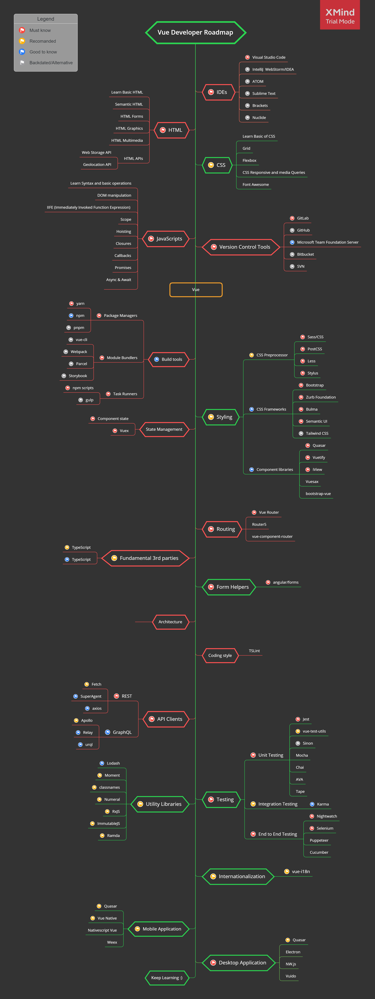

## Vue Developer Roadmap

> A practical, developer-focused **roadmap** to becoming a **Vue Developer** in 2026 — covering the essential tools, libraries, and concepts you need along the way.

Below you can find a chart demonstrating the paths that you can take and the libraries that you would want to learn to become a Vue developer. I made this chart as a tip for everyone who asks me, "What should I learn next as a Vue developer?"

**[⬆ Back to Top](#table-of-contents)**

## Table of Contents

| No. | Topic                                                                  |
| --- | ---------------------------------------------------------------------- |
| 1   | [Roadmap](#1-roadmap)                                                  |
| 2   | [IDEs](#2-ides)                                                        |
| 3   | [HTML](#3-html)                                                        |
| 4   | [CSS](#4-css)                                                          |
| 5   | [JavaScript](#5-javascript)                                            |
| 6   | [Vue](#6-vue)                                                          |
| 7   | [Routing](#7-routing)                                                  |
| 8   | [Build Tools](#8-build-tools)                                          |
| 9   | [UI Design](#9-ui-design)                                              |
| 10  | [API Clients](#10-api-clients)                                         |
| 11  | [Fundamental 3rd Parties](#11-fundamental-3rd-parties)                 |
| 12  | [State Management](#12-state-management)                               |
| 13  | [Architecture](#13-architecture)                                       |
| 14  | [Coding Style](#14-coding-style)                                       |
| 15  | [Utility Libraries](#15-utility-libraries)                             |
| 16  | [Testing](#16-testing)                                                 |
| 17  | [Internationalization](#17-internationalization)                       |
| 18  | [Progressive Web Apps](#18-progressive-web-apps)                       |
| 19  | [Server-Side Rendering](#19-server-side-rendering)                     |
| 20  | [Mobile Application Development](#20-mobile-application-development)   |
| 21  | [Desktop Application Development](#21-desktop-application-development) |

**[⬆ Back to Top](#table-of-contents)**

## 1. Roadmap

    

**[⬆ Back to Top](#table-of-contents)**

## 2. IDEs

| IDE                                                          | Short Description                                   | Pricing      |
| ------------------------------------------------------------ | --------------------------------------------------- | ------------ |
| [Visual Studio Code](https://code.visualstudio.com/Download) | Lightweight and highly extensible code editor.      | **Free**     |
| [WebStorm](https://www.jetbrains.com/webstorm/)              | Powerful IDE for modern JavaScript development.     | **Paid**     |
| [Bolt](https://bolt.new/)                                    | AI-powered tool for building web applications.      | **Freemium** |
| [Cursor](https://www.cursor.com/)                            | AI-powered code editor with smart assistance.       | **Freemium** |
| [Sublime Text](https://www.sublimetext.com/)                 | Fast and customizable lightweight editor.           | **Paid**     |
| [Atom](https://atom.io/)                                     | Open-source and highly customizable code editor.    | **Free**     |
| [Brackets](http://brackets.io/)                              | Frontend-focused editor with live preview.          | **Free**     |
| [Eclipse](https://www.eclipse.org/)                          | Extensible IDE for Java and enterprise development. | **Free**     |

**[⬆ Back to Top](#table-of-contents)**

## 3. HTML

- [w3schools](https://www.w3schools.com/html/) HTML Tutorial
- [MDN Web Docs](https://developer.mozilla.org/en-US/docs/Web/HTML) HTML: HyperText Markup Language

**[⬆ Back to Top](#table-of-contents)**

## 4. CSS

- [w3schools](https://www.w3schools.com/css/) CSS Tutorial
- [MDN Web Docs](https://developer.mozilla.org/en-US/docs/Web/CSS) CSS: Cascading Style Sheets
- [fontawesome](https://fontawesome.com/) Official website
- [w3schools](https://www.w3schools.com/icons/icons_reference.asp) Icons Reference

**[⬆ Back to Top](#table-of-contents)**

## 5. JavaScript

_Basic_

- [w3schools](https://www.w3schools.com/js/default.asp) JavaScript Tutorial
- [developer.mozilla](https://developer.mozilla.org/en-US/docs/Web/JavaScript) JavaScript
- [javascript.info](https://javascript.info/) The Modern JavaScript Tutorial
- [htmlcheatsheet](https://htmlcheatsheet.com/js/) JS CheatSheet

_ES6_

- [exploringjs](https://exploringjs.com/es6/index.html) Exploring ES6
- [compat-table](https://compat-table.github.io/compat-table/es6/) ECMAScript 6 compatibility table
- [babeljs](https://babeljs.io/docs/en/learn) Learn ES2015
- [github](https://github.com/lukehoban/es6features) ECMAScript 6
- [github](https://github.com/sudheerj/ECMAScript-features) ECMAScript 6

_Style Guide_

- [github](https://github.com/airbnb/javascript) Airbnb JavaScript Style Guide
- [github](https://github.com/ryanmcdermott/clean-code-javascript) clean-code-javascript

_Playground_

- [js-array-playground](https://js-array-playground.firebaseapp.com/) JavaScript Array Playground
- [jsfiddle](https://jsfiddle.net/)
- [plnkr](https://plnkr.co/)
- [jsbin](https://jsbin.com/?html,output)
- [codepen](https://codepen.io/pen/)
- [stackblitz](https://stackblitz.com/)

**[⬆ Back to Top](#table-of-contents)**

## 6. Vue

- [Official website](https://vuejs.org/)
- [View forms](https://vuejs.org/v2/guide/forms.html)
- [View components](https://vuejs.org/v2/guide/components.html)

**[⬆ Back to Top](#table-of-contents)**

## 7. Routing

- [Vue Router](https://router.vuejs.org/)
- [Router5](https://router5.js.org/)

**[⬆ Back to Top](#table-of-contents)**

## 8. Build Tools

- Package Managers
  - [npm](https://www.npmjs.com/)
  - [yarn](https://yarnpkg.com/)
  - [pnpm](https://pnpm.io/)
- Module Bundlers
  - [Vite](https://vitejs.dev/) — official build tool for Vue
  - [create-vue](https://github.com/vuejs/create-vue) — official scaffolding tool (successor of vue-cli)
  - [Webpack](https://webpack.js.org/)
  - [esbuild](https://esbuild.github.io/)
  - [Rollup](https://rollupjs.org/)
  - [Bazel](https://bazel.build/)
- Task Runners
  - [npm scripts](https://docs.npmjs.com/misc/scripts)
  - [gulp](https://gulpjs.com/)
  - [grunt](https://gruntjs.com/)

**[⬆ Back to Top](#table-of-contents)**

## 9. UI Design

- CSS Preprocessor
  - [Sass/CSS](https://sass-lang.com/)
  - [PostCSS](https://postcss.org/)
  - [Less](http://lesscss.org/)
  - [Stylus](http://stylus-lang.com/)
- CSS Frameworks
  - [Bootstrap](https://getbootstrap.com/)
  - [Materialize](https://materializecss.com/)
  - [Bulma](https://bulma.io/)
  - [Semantic UI](https://semantic-ui.com/)
- Utility-First CSS
  - [Tailwind CSS](https://tailwindcss.com/)
  - [UnoCSS](https://unocss.dev/)
- Component Libraries
  - [Vuetify](https://vuetifyjs.com/) — Material Design component framework for Vue
  - [Quasar](https://quasar.dev/) — high-performance Vue framework for web, mobile, and desktop
  - [PrimeVue](https://primevue.org/) — rich set of open source UI components for Vue
  - [Element Plus](https://element-plus.org/) — Vue 3 based component library
  - [Naive UI](https://www.naiveui.com/) — fully typed Vue 3 component library

**[⬆ Back to Top](#table-of-contents)**

## 10. API Clients

- REST
  - [Fetch](https://developer.mozilla.org/en-US/docs/Web/API/Fetch_API)
  - [SuperAgent](https://visionmedia.github.io/superagent/)
  - [axios](https://github.com/axios/axios)
- GraphQL
  - [Apollo](https://v4.apollo.vuejs.org/) — GraphQL client for Vue 3
  - [urql](https://github.com/FormidableLabs/urql)
  - [Villus](https://villus.dev/) — small and fast GraphQL client for Vue

**[⬆ Back to Top](#table-of-contents)**

## 11. Fundamental 3rd Parties

- TypeScript
  - ["TypeScript Deep Dive"](https://github.com/basarat/typescript-book)
  - [Typescript Docs](https://www.typescriptlang.org/docs/)
  - [TypeScript with Vue](https://vuejs.org/guide/typescript/)
- VueUse
  - [VueUse](https://vueuse.org/) — collection of essential Vue composition utilities
  - [VueUse playground](https://play.vueuse.org/)

**[⬆ Back to Top](#table-of-contents)**

## 12. State Management

- [Pinia](https://pinia.vuejs.org/) — official state management library for Vue
- [pinia-plugin-persistedstate](https://prazdevs.github.io/pinia-plugin-persistedstate/)
- [Vuex](https://vuex.vuejs.org/) (legacy — Pinia is the official successor)

**[⬆ Back to Top](#table-of-contents)**

## 13. Architecture

- [Composables](https://vuejs.org/guide/reusability/composables.html)
- [Custom Directives](https://vuejs.org/guide/reusability/directives.html)

**[⬆ Back to Top](#table-of-contents)**

## 14. Coding Style

- [Vue Styleguide](https://vuejs.org/style-guide/)
- [ESLint](https://eslint.org/) with [typescript-eslint](https://typescript-eslint.io/) (replaces the deprecated TSLint)
- [Prettier](https://prettier.io/)

**[⬆ Back to Top](#table-of-contents)**

## 15. Utility Libraries

- [Lodash](https://lodash.com/)
- [Moment](https://momentjs.com/) (maintenance mode – consider [date-fns](https://date-fns.org/), [Day.js](https://day.js.org/), or [Luxon](https://moment.github.io/luxon/))
- [classnames](https://github.com/JedWatson/classnames)
- [Numeral](http://numeraljs.com/)
- [ImmutableJS](https://facebook.github.io/immutable-js/)
- [Ramda](https://ramdajs.com/)

**[⬆ Back to Top](#table-of-contents)**

## 16. Testing

- Unit Testing
  - [Vitest](https://vitest.dev/) — recommended unit testing framework for Vue
  - [Jest](https://jestjs.io/)
  - [Vue Test Utils](https://test-utils.vuejs.org/) — official testing utilities for Vue
- E2E Testing
  - [Cypress](https://www.cypress.io/)
  - [Playwright](https://playwright.dev/)

> Note: [Karma](https://karma-runner.github.io/) reached end-of-life in August 2023 — prefer Vitest for unit testing and Cypress or Playwright for E2E testing.

**[⬆ Back to Top](#table-of-contents)**

## 17. Internationalization

- [vue-i18n](https://vue-i18n.intlify.dev/)

**[⬆ Back to Top](#table-of-contents)**

## 18. Progressive Web Apps

- [Vite PWA](https://vite-pwa-org.netlify.app/) — zero-config PWA plugin for Vite
- [Workbox](https://developer.chrome.com/docs/workbox/)

**[⬆ Back to Top](#table-of-contents)**

## 19. Server-Side Rendering

- [Nuxt](https://nuxt.com/) — full-stack Vue framework with SSR/SSG support
- [SSR guide](https://vuejs.org/guide/scaling-up/ssr.html) — built-in server-side rendering with hydration
- [VitePress](https://vitepress.dev/) — static site generator (successor of VuePress)

**[⬆ Back to Top](#table-of-contents)**

## 20. Mobile Application Development

- [Ionic Vue](https://ionicframework.com/docs/vue)
- [NativeScript-Vue](https://nativescript-vue.org/)
- [Quasar](https://quasar.dev/)

**[⬆ Back to Top](#table-of-contents)**

## 21. Desktop Application Development

- [Electron](https://www.electronjs.org/)
- [Tauri](https://tauri.app/)
- [Quasar](https://quasar.dev/)
- [NW.js](https://nwjs.io/)

**[⬆ Back to Top](#table-of-contents)**

## Author

**Md. Saiful Islam**
_Microsoft Certified Solutions Developer (MCSD) – Programming in C#_

**GitHub:** [@saifaustcse](https://github.com/saifaustcse)
**LinkedIn:** [Md. Saiful Islam](https://www.linkedin.com/in/saif-aust-cse/)

If you find this roadmap useful, please give :star:. Your support is appreciated!
